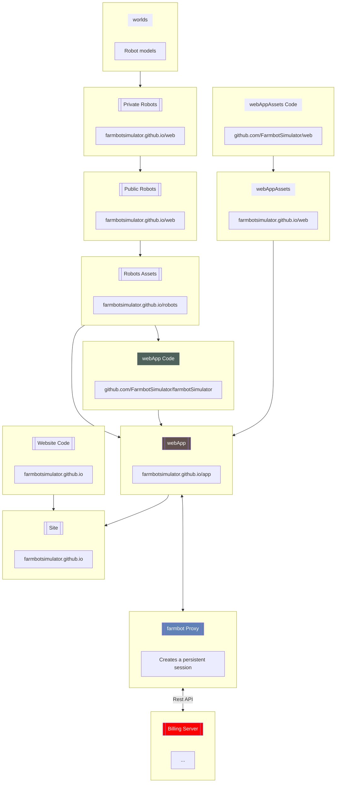

# Farmbot Simulator

We are building a simulator for the [Farmbot Agricultural Robot](https://farm.bot) for use in both education and research. You can now learn to program and control the robot without a physical robot present and test your sequences before deploying them to a real robot.

It is especially useful in education where several students may require to program a robot yet it is neither feasible to have a robot per student nor can the students all test certain functions like irrigation on a single real garden.

We have implemented the following features:
- [ ] Basic movement
- [ ] Different robots
- [ ] Tool handling
- [ ] Plant growth
- [ ] Day and night simulation

